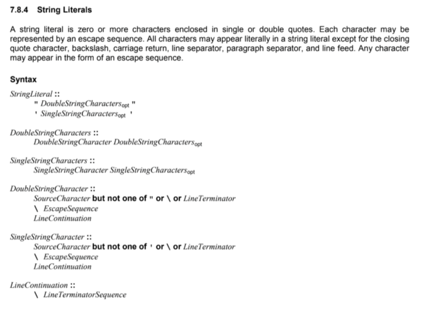
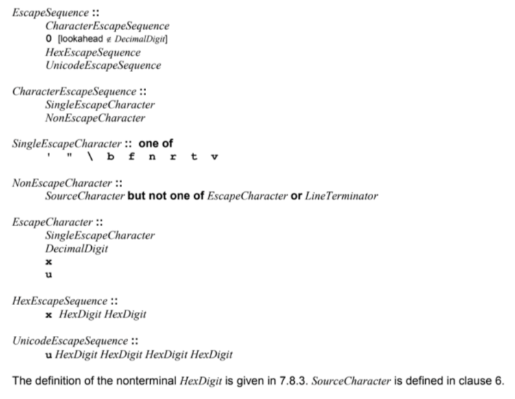

HexDigit: ^[0-9a-fA-F]+$

DecimalDigits: ^[0-9]+$

UnicodeEscapeSequence: ^u[0-9a-fA-F]{4}$

HexEscapeSequence: ^x[0-9a-fA-F]{2}$

SingleEscapeCharacter: ^[\’\”\\\b\f\n\r\t\v]$

EscapeCharacter: ^[\’\”\\\b\f\n\r\t\v0-9xu]$

LineTerminator: ^[\u000A\u000D\u2028\u2029]$

LineTerminatorSequence: ^[\u000A\u000D(?!\u000A)\u2028\u2029\u000D(?=\u000A)]$

NonEscapeCharacter: ^[^\’\”\\\b\f\n\r\t\v0-9xu\u000A\u000D\u2028\u2029]$

CharacterEscapeSequence: ^[\’\”\\\b\f\n\r\t\v]|[^\’\”\\\b\f\n\r\t\v0-9xu\u000A\u000D\u2028\u2029]$

EscapeSequence: ^([\’\”\\\b\f\n\r\t\v]|[^\’\”\\\b\f\n\r\t\v0-9xu\u000A\u000D\u2028\u2029)|(0?&lt;![0-9])|(x[0-9a-fA-F]{2})|(u[0-9a-fA-F]{4})]$

LineContinuation: ^\\[\u000A\u000D(?!\u000A)\u2028\u2029\u000D(?=\u000A)]$

SingleStringCharacter: ^[^\u000A\u000D\u2028\u2029]|\([\’\”\\\b\f\n\r\t\v]|[^\’\”\\\b\f\n\r\t\v0-9xu\u000A\u000D\u2028\u2029)|(0?&lt;![0-9])|(x[0-9a-fA-F]{2})|(u[0-9a-fA-F]{4})]|\\[\u000A\u000D(?!\u000A)\u2028\u2029\u000D(?=\u000A)]$

Stringliteral: ^\”[^\u000A\u000D\u2028\u2029]|\([\’\”\\\b\f\n\r\t\v]|[^\’\”\\\b\f\n\r\t\v0-9xu\u000A\u000D\u2028\u2029)|(0?&lt;![0-9])|(x[0-9a-fA-F]{2})|(u[0-9a-fA-F]{4})]|\\[\u000A\u000D(?!\u000A)\u2028\u2029\u000D(?=\u000A)]\”|\’[^\u000A\u000D\u2028\u2029]|\([\’\”\\\b\f\n\r\t\v]|[^\’\”\\\b\f\n\r\t\v0-9xu\u000A\u000D\u2028\u2029)|(0?&lt;![0-9])|(x[0-9a-fA-F]{2})|(u[0-9a-fA-F]{4})]|\\[\u000A\u000D(?!\u000A)\u2028\u2029\u000D(?=\u000A)]\’$
